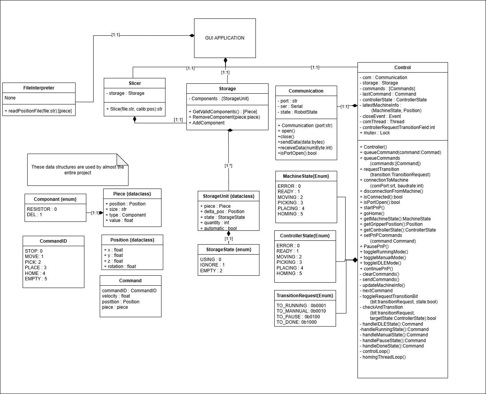
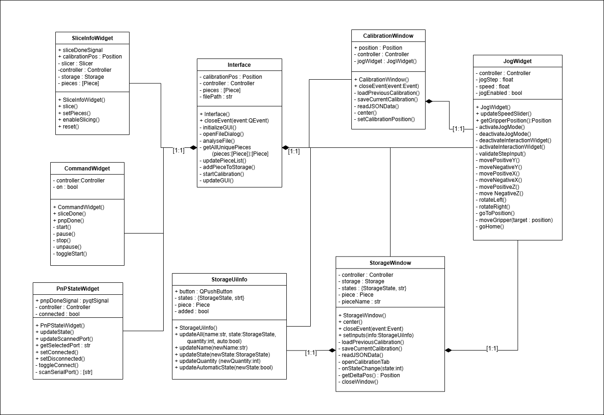

# HMI (Python Host Interface)

Cross-platform graphical interface for controlling the PickUS and PlacUS machine. Communicate with the ESP32 firmware over USB serial, import KiCad placement files, and orchestrate pick-and-place operations.

## Prerequisites

- Python 3.8 or higher
- `pip` package manager
- USB connection to ESP32-S3 board

## Installation

1. **Install dependencies**
   ```bash
   pip install pyserial
   ```

2. **Navigate to HMI source folder**
   ```bash
   cd HMI/src
   ```

3. **Run the HMI**
   ```bash
   python main.py
   ```

---

## Configuration

### Serial Port Settings

To find your port:
- **Windows**: Device Manager → Ports (COM & LPT)
- **Linux**: Run `ls /dev/ttyUSB*`
- **macOS**: Run `ls /dev/tty.usbserial*`

---

## Usage

### Typical Workflow

1. Launch the HMI: `python main.py`
2. Load a KiCad `.pos` file via the GUI
3. Home the machine to access manual mode
4. Configure component feeders for each tray
   1. Fill all of the required fields in the displayed window
   2. Place the tip of the gripper on the first piece of the storage
   3. Confirm to save the data 
5. Calibrate PCB position
   1. place the tip of the gripper on the calibration point of the PCB (has to be set by the user in KiCad)
   2. Confirm to save the data 
6. Generate commands by clicking the slice button
5. Start the pick-and-place cycle
6. Monitor progress and pause/resume as needed

### HMI Module Overview

| Module | Responsibility |
|--------|---|
| `Controller` | Manages state, command queue, and background control loop |
| `CommandDispatcher` | Queues commands and serializes them for transport |
| `PnPStateMachine` | Resolves controller state transitions and next commands |
| `MachineTelemetryDecoder` | Decodes telemetry packets from the ESP32 |
| `HomingService` | Runs the homing workflow in a background thread |
| `Communication` | Low-level UART wrapper around `pyserial` |
| `FileInterpreter` | Parses KiCad `.pos` placement files into `Piece` objects |
| `Slicer` | Generates ordered `Command` sequence: pick → move → place per component |
| `Storage` | Tracks available components in feeder trays |

---

## Testing

### Run All Tests

```bash
cd HMI/tests
python run_test.py
```

### Individual Test Files

- `test_controller_communication.py` — Serial protocol tests
- `test_file_interpreter.py` — KiCad `.pos` file parsing
- `test_slicer.py` — Command sequence generation
- `test_storage.py` — Feeder tray logic

Each test file can be run independently:

```bash
python test_file_interpreter.py
```

---

## Project Structure

```
HMI/
├── src/                     # Main HMI modules
│   ├── main.py              # Entry point
│   ├── communication.py      # Serial protocol
│   ├── controller.py         # Command orchestration
│   ├── command_dispatcher.py # Controller command queue management
│   ├── data.py              # Data models
│   ├── file_interpreter.py  # KiCad .pos parser
│   ├── homing_service.py    # Homing workflow
│   ├── machine_telemetry_decoder.py # Telemetry packet decoding
│   ├── slicer.py            # Command generation
│   ├── pnp_state_machine.py  # Controller state transitions
│   ├── storage.py           # Component inventory
│   ├── utils.py             # Utilities
│   └── gui/                 # GUI components
│       ├── interface.py
│       ├── command_widget.py
│       ├── jog_widget.py
│       ├── pnp_state_widget.py
│       └── ...
├── tests/                   # Unit and integration tests
│   ├── run_test.py          # Test runner
│   ├── test_*.py            # Individual test modules
│   └── data/                # Test data files
├── data/                    # Sample data files
└── README.md
```

---

## Class Diagram
### Main project UML


### GUI UML


---

## Dependencies

- `pyserial` — serial communication with ESP32

---

## Troubleshooting

### Cannot Connect to Serial Port
- Verify the ESP32 is plugged in and connected
- Check Device Manager for the correct COM port
- Ensure no other application is using the port
- Try unplugging and replugging the USB cable

### FileNotFoundError: Cannot find .pos file
- Ensure the full path to the KiCad placement file is correct
- Verify the file exists and is readable

### Commands Not Executing
- Check that the ESP32 firmware is running and responsive
- Open serial monitor to verify communication: `pio device monitor` (in Firmware_esp32 folder)
- Verify baud rate matches (115200)

---

## Next Steps

- See [main README](../README.md) for project overview
- See [Firmware README](../Firmware_esp32/) for ESP32 setup and configuration
- See [Electrical README](../Electrical/) for hardware design
- See [Mechanical README](../Mechanical/) for mechanical design
