# Mechanical instructions

The Pick and place is built in a specific way with complex pieces, to insure a good functionning device, please follow the instructions provided.

## Bill of Material

The project is made with pieces and component purchased on the internet. Including alluminum extrusion, gears, belts, rails and motors. But a big part of the project can be 3d printed and laser cutted. 

### Pieces to Print or Laser cut

All the STL files needed are provided in the Mechanical folder in a folder named STL_Files. We recommend to print all the pieces before starting the assembly, but the pieces needed in each instruction will be cited so can be printed in order. All the pieces are printed with PLA for reduced costs.

There is also a MakerWord project created with all the pieces ready to print. https://makerworld.com/en/models/2670527-pickus-and-plackus#profileId-2955730

The base plate is laser cutted for a size reason and is made of wood.

### Pieces to Buy

All the pieces or component to buy are in the Mechanical folder named BOM. The Bill of Material contain all the pieces needed to complete de Project with links to the websites. Please note that the product were purchased and delivered in Canada so some of the links may not work or be discontinued.

The pieces were bought principally on Amazon.ca and Aliexpress.com. 

## Instructions

The complete assembly is provided in the STL_Files folder to guide you during the assembly process.

### Step 1 : Base

#### Pieces needed: 
1. Alluminum extrusion 7x
#### Print Needed:
1. FootMountSS-BackRight.stl
2. FootMountSS-FrontRight.stl
3. FootMountSS-BackLeft.stl
4. FootMountSS-FrontLeft.stl
5. 90DegreesJoint.stl 2x
6. BasePlateSupport.stl (Laser Cutted)
7. BasePlate.stl (Laser Cutted)

Please Note: Always place the T-nuts needed in the extrusions before assembling.

First, Install the two 90 degrees joint in the middle of two alluminum extrusions. These will be on the front and back. Then, build a square with the four foot mounts, make sure to place them at the right place. Place the fifth extrusion in the middle and install the BasePlateSupport. Secure it in the four corners and then place the two remaining extrusions on the two sides. 

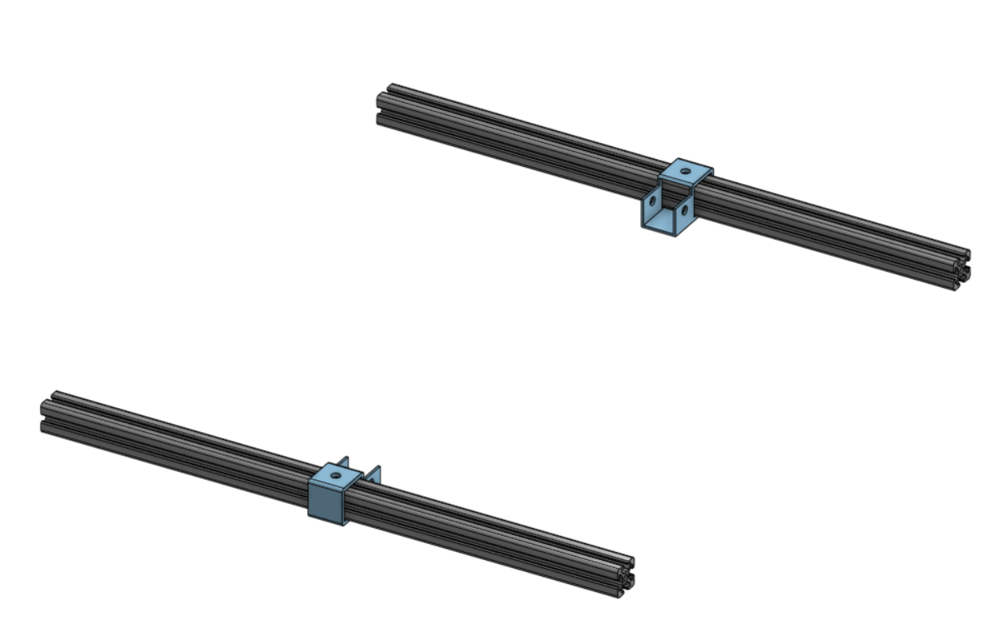
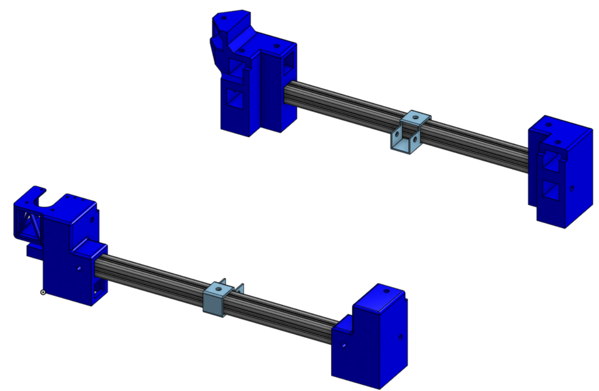
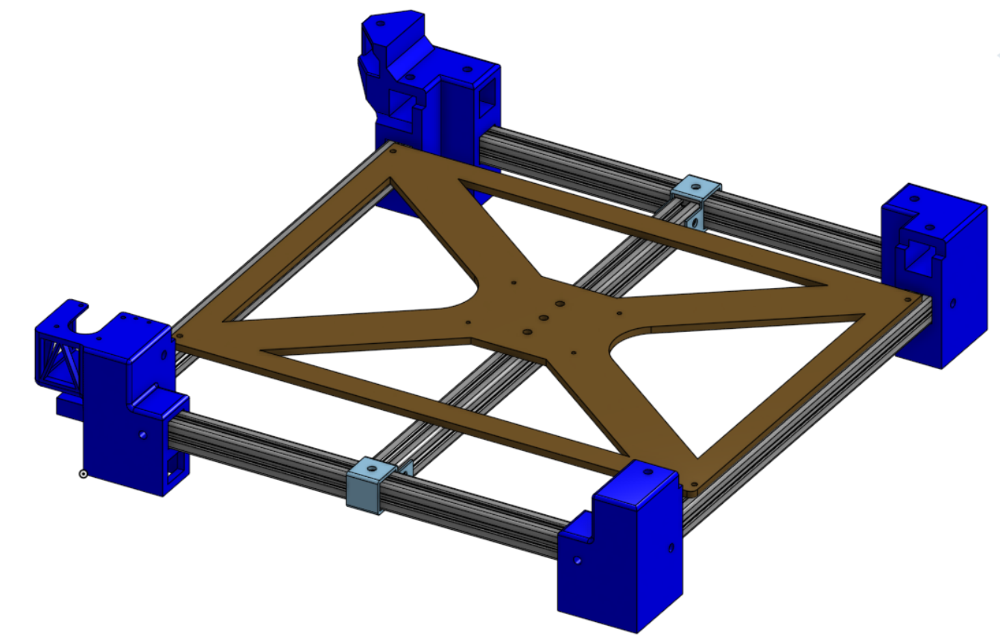
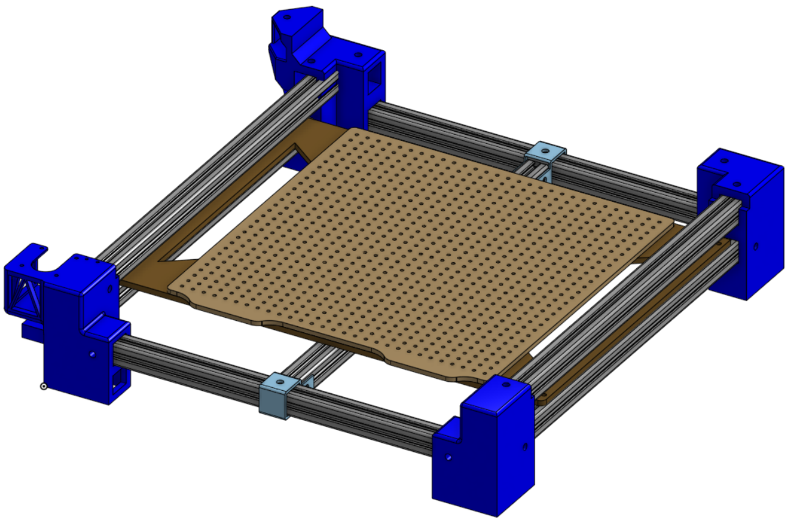
---
### Step 2 : Y Movement

#### Pieces needed: 
1. Linear rails 2x
2. Gear 2x
3. Timing belt
4. Timing Belt Fixing Piece
5. Heat insert M4
6. Nema 17 motor
#### Print Needed:
1. Adaptor_RailY_Extrude_Inferior.stl 2x

Install the two rails with M3 bolts and Tnuts on the top extrusions. Place a heat insert in one of the printed piece and fix it to the moving cart on the left side, heat insert in the direction of the exterior of the device. Fix the other one on the opposite side. Place the gears, one on the motor, one with a M5 nut and bolt on the back left footmount. Cut the timing belt at the length needed, install on the gears but dont install now the motor. Put each extrimity of the belt on the fixing piece and then screw it in the heat insert. Now, install the motor in the front left foot mount. If the belt is too loose, you can cut it a little bit to have good belt tension. The gear on the motor must be scewed on the shaft and the other one left loose.

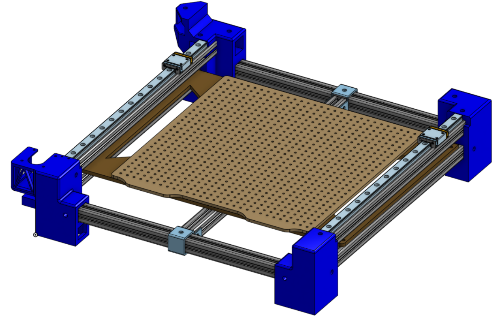
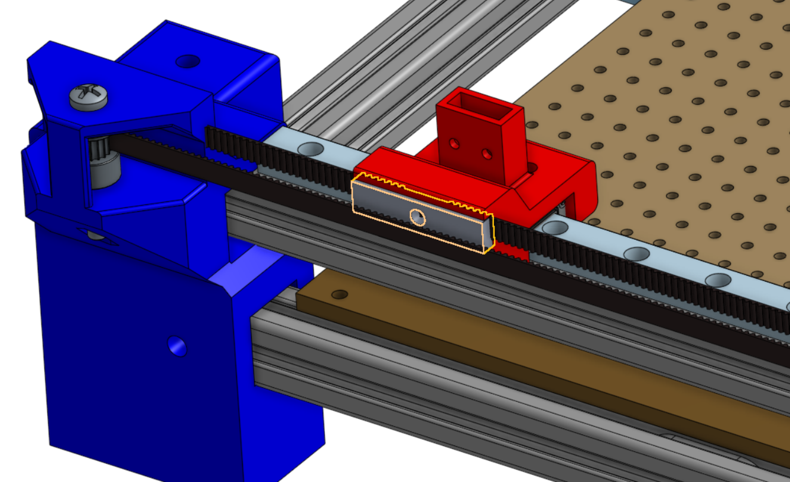
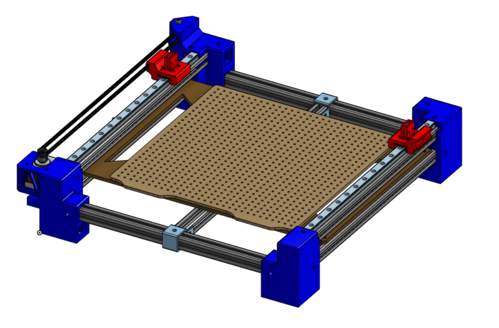
---
### Step 3 : X Movement

#### Pieces needed: 
1. Linear rails 1x
2. Gear 2x
3. Timing belt
4. Timing Belt Fixing Piece
5. Heat insert M4
6. Nema 17 motor
7. alluminum extrusion
#### Print Needed:
1. Adaptor_RailY_Superior_Motor.stl
2. Adaptor_RailY_Extrude_Superior_Idle.stl
3. PnPHead.stl

Put the two complement on the rails. Big one on the motor side. Put a heat insert on the back of the PnP Head. Place the extrusion with a linear rail on the side facing the front. Screw the PnP head on the cart. Install the gears and timing belt as done in step 2 but install the motor first. 

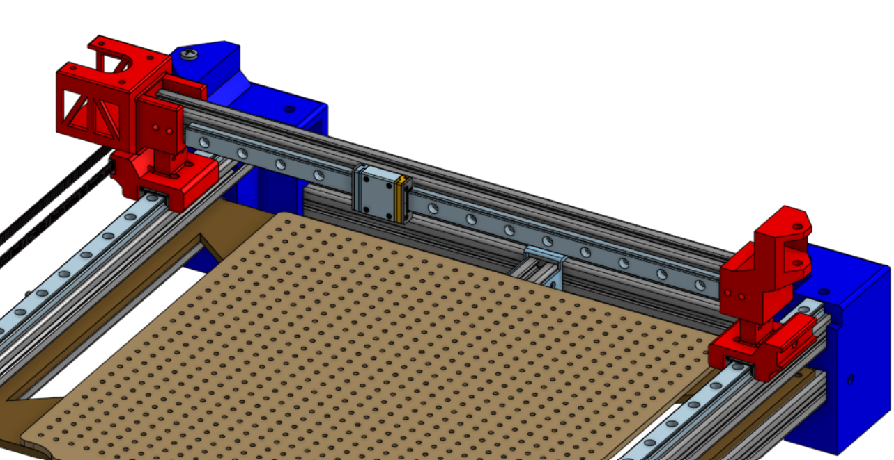
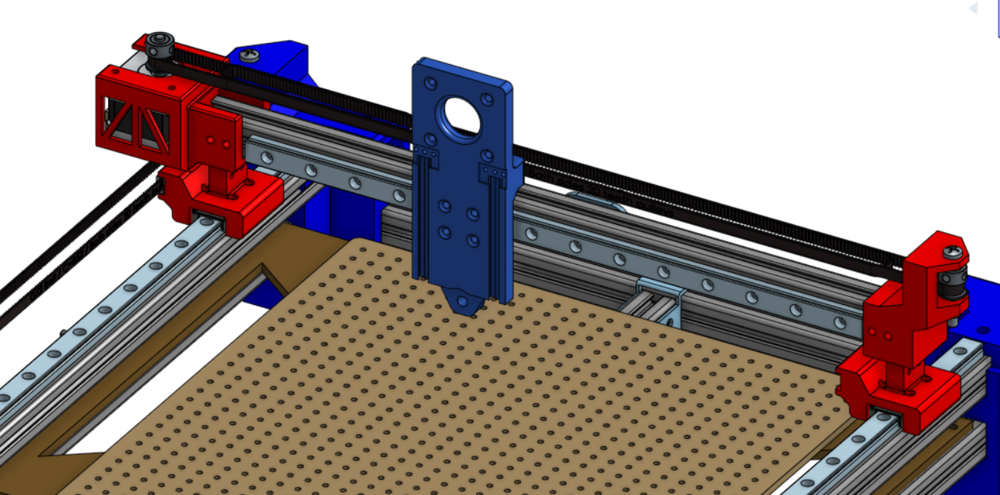
---
### Step 4 : Z Movement and yaw

#### Pieces needed: 
1. Gear 2x
2. Timing belt
3. Timing Belt Fixing Piece
4. Heat insert M4
5. Nema 17 motor (small)
6. Nema 8 motor + toolhead
#### Print Needed:
1. PnPPicker.stl

Put a heat insert on the hole on the side of the PnP Picker piece. Install the Nema 8 motor and nozzle on the PnP Picker piece. Install the small Nema 17 motor on top of the PnP Head. Insert the Picker into the Head left rail. Then, install the gears and timing belt. 

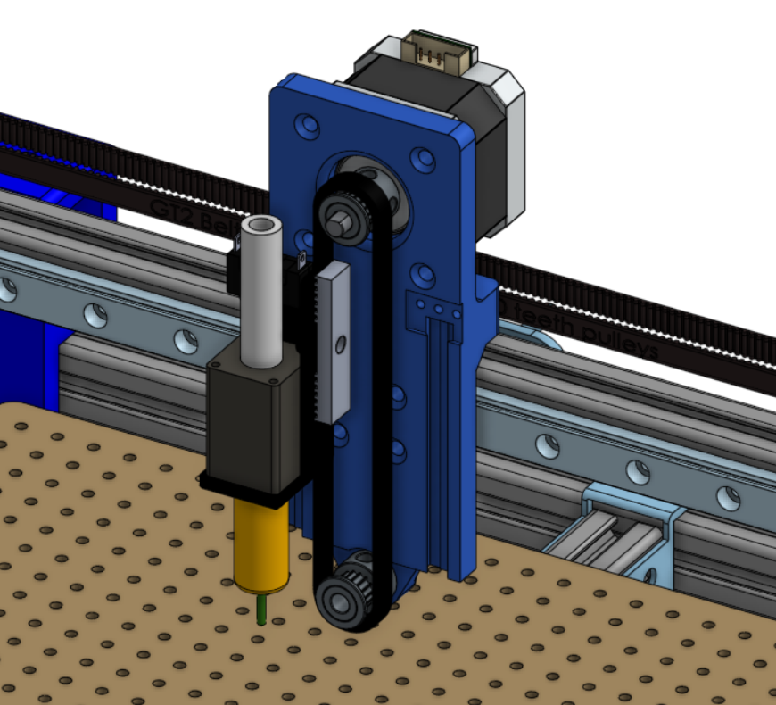
---
### Step 5 : Limit Switch, cable management, cable chain and (electric box (peut être dans une autre étape))

#### Pieces needed: 
1. Heat insert M4 x4
2. Cables
3. Limit Switch x3
4. Electric components
#### Print Needed:
1. Chain_Adaptor_1.stl
2. Chain_adaptor_2.stl
3. Chain_Adaptor_3.stl
4. Chain_Adaptor_4.stl
5. Chain_Link.stl x25
6. Chain_Cover.stl x 20
7. Chain_Support_TRail_YAxis.stl x3
8. Electric_Box.stl

It is now time to put all the cables and the XYZ limit switches. Make sure to cut long enough wires for it to pass trough the cable chains (if you want to install some). You can put all the electrics (PCB, Vacuum, drives) in the electric box underneath the PnP. 

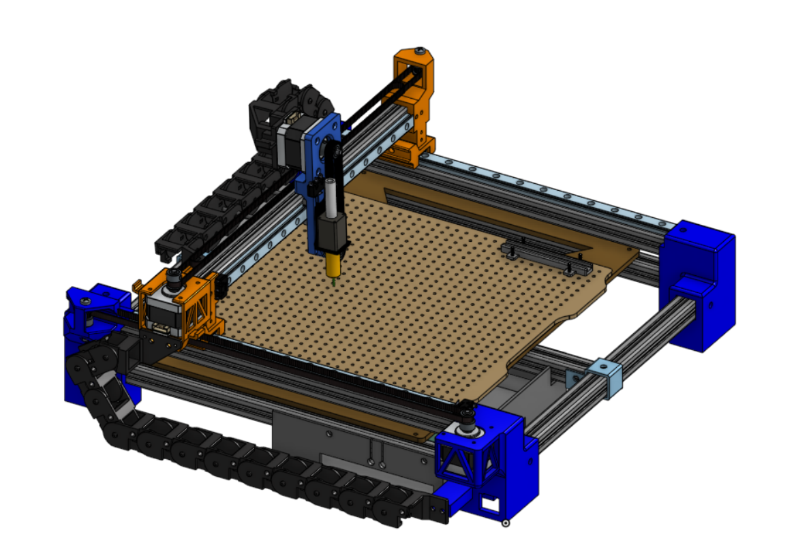
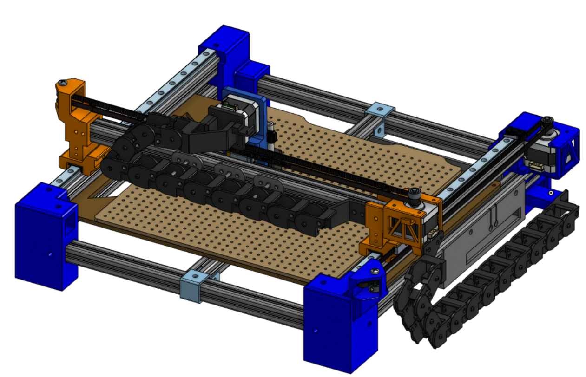